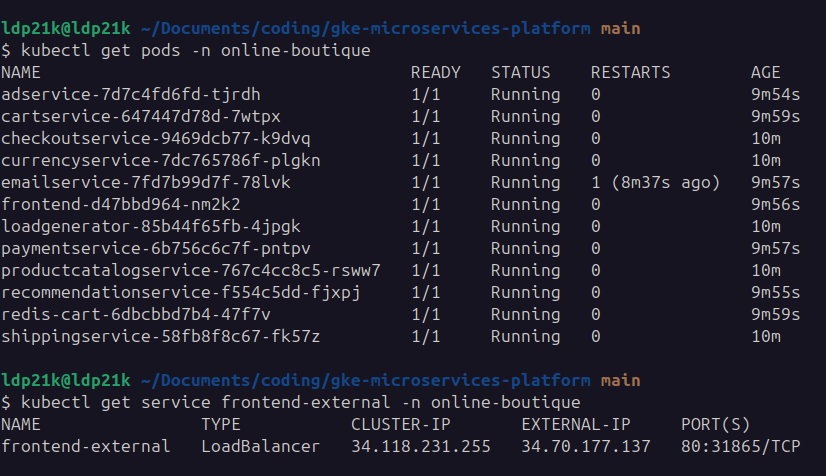
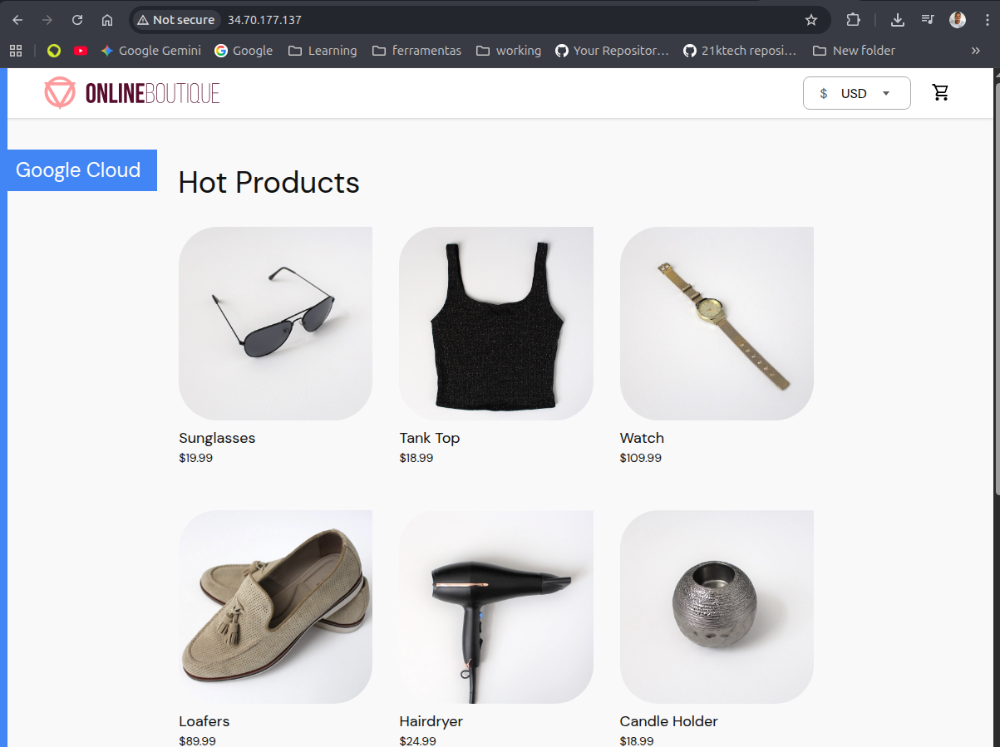

<div align="center">
  

  <h1>🚀 GKE Microservices Platform (Online Boutique)</h1>

  <p><i>A lean, professional, and secure deployment of Google's 11-tier microservices application on Kubernetes.</i></p>

  <!-- Badges -->
  
  
  
  
</div>

<h2> 🎯 Mission </h2>

A **lean, production-style Kubernetes platform** built to prove that the basics are enough when done right.

Ship fast, keep it simple, and operate with confidence.

* No ClickOps
* No static credentials
* No node management
* No manual deployments

Only infrastructure as code, secure automation, GitOps workflows, and GKE Autopilot.

This project shows how Platform Engineering principles can reduce complexity while still supporting a real 11-microservice system with security, scalability, and cost efficiency built in from day one.

## 🏗️ Architecture at a Glance

<div align="center">
  
</div>

<br>

- **☁️ Cloud Provider:** Google Cloud Platform (GCP)
- **🧱 Infrastructure as Code:** Terraform (State stored remotely and securely in a GCS bucket)
- **☸️ Kubernetes:** GKE Autopilot (Cost-effective, zero node management, pay-per-pod)
- **🤖 CI/CD:** GitHub Actions (Direct deployment via `kubectl`)
- **🛡️ Security:** Workload Identity Federation (Keyless authentication - OIDC)

---

## 🚀 The Pipeline (GitOps Flow)

This repository is fully automated. Merging to `main` triggers the following lifecycle:

1. **🔐 Auth:** GitHub Actions exchanges its OIDC token for a temporary GCP access token via Workload Identity.
2. **🏗️ Provisioning:** `terraform plan` and `terraform apply` ensure the VPC, Subnets, and GKE cluster are in the desired state.
3. **🚢 Deployment:** The pipeline connects to GKE and applies the Kubernetes manifests for all 11 microservices (Frontend, Cart, Redis, Checkout, etc.) in the `online-boutique` namespace.
4. **✅ Health Check:** `kubectl rollout status` waits for the frontend to be fully available before marking the pipeline as successful.

---

## 📸 Mission Accomplished (The Proof)

Here is the infrastructure running successfully in production:

### 1. Terraform & GitHub Actions in perfect sync



### 2. The 11 Microservices alive on GKE



---

## 🧹 Cost Optimization (Teardown)

To keep the cloud bill lean after the demonstration, the entire environment can be destroyed safely:

```bash
terraform destroy -var="project_id=YOUR_PROJECT_ID"
```
